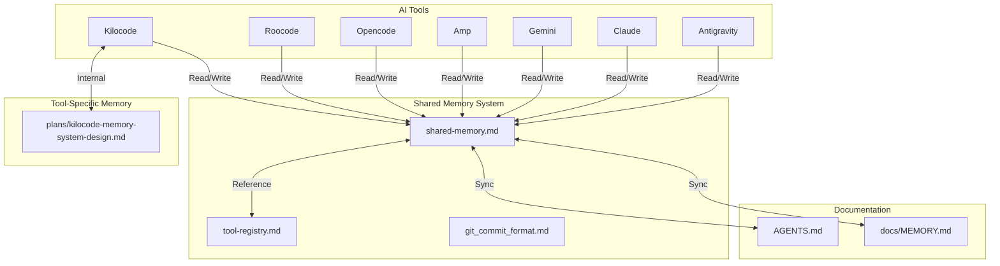

# Shared Memory Pool

This file serves as a consolidated memory pool that all AI tools (Kilocode, Roocode, Opencode, Amp, Gemini, Claude, Antigravity, etc.) can read from and write to.

## Purpose

The shared memory pool provides:
- **Unified Context**: All tools share the same project understanding
- **Cross-Tool Continuity**: Work started in one tool can be continued in another
- **Consolidated History**: Single source of truth for project state
- **Tool Agnostic**: Works independently of any specific tool's internal memory system

## Structure



## Working Pattern

### When Starting a Session (Any Tool)

1. **Read Tool Registry** (`docs/memory/tool-registry.md`):
   - Identify which tool you are (Kilocode, Roocode, Opencode, etc.)
   - Find your tool's entry in the registry
   - Understand your tool's role and any special instructions

2. **Read Shared Memory** (`docs/memory/shared-memory.md`):
   - Read recent entries (last 5-10) to understand current state
   - Check "Current Focus" for what was being worked on
   - Review "Pending Tasks" for incomplete work
   - Note any tool-specific context relevant to your work

3. **Read Tool-Specific Documentation** (if exists):
   - Read your tool's design document (e.g., `plans/kilocode-memory-system-design.md`)
   - Understand tool-specific patterns and conventions
   - Adapt your working pattern to the tool's strengths

4. **Read Project Documentation**:
   - Read relevant sections of `AGENTS.md`
   - Read `docs/MEMORY.md` for query history and context
   - Understand project structure and conventions

5. **Report to User**:
   - Confirm context is loaded
   - Summarize what you know about the project
   - List pending tasks with `t{number}` prefix
   - Offer to continue with next task or accept new work

### During Work (Any Tool)

1. **Make Incremental Changes**: Update shared memory as you work, not just at the end
2. **Document Decisions**: Explain why you're making changes, not just what
3. **Sync with Project Docs**: Keep `docs/MEMORY.md` and other docs in sync with shared memory
4. **Track Tool-Specific Notes**: Document tool-specific patterns or issues in tool registry

### When Ending a Session (Any Tool)

1. **Update Shared Memory**:
   - Document work completed
   - Update task statuses
   - Add any new patterns or rules learned
   - Note any incomplete work that should be continued

2. **Sync with Tool-Specific Memory**:
   - If your tool has its own memory system, sync relevant information
   - Cross-reference shared memory entries with tool-specific entries
   - Ensure consistency between systems

3. **Report Completion**:
   - Summarize what was accomplished
   - List any incomplete items
   - Suggest next steps if appropriate

## Memory Entry Format

### [YYYY-MM-DD HH:MM UTC] - Tool: {Tool Name} - {Title}

**Tool**: Kilocode | Roocode | Opencode | Amp | Gemini | Claude | Antigravity
**Session ID**: {Unique identifier for this session}
**Task Type**: Assigned Task | User-Directed Narrative | Discovery | Planning
**Status**: In Progress | Completed | Blocked | Abandoned

**Summary**: Brief summary of what was done or is being worked on

**Context**: Any relevant context, environment, previous state, etc.

**Decisions Made**: (optional)
- Decision 1: Reason for decision
- Decision 2: Reason for decision

**Files Changed**: (optional)
- Added: [`file1`](file1), [`file2`](file2)
- Modified: [`file3`](file3)
- Deleted: [`file4`](file4)

**Tools Used**: (optional)
- MCP servers: {list if any}
- External APIs: {list if any}
- Special commands: {list if any}

**Outcome**: Result or status (e.g., "Completed", "In Progress", "Blocked")

**Notes**: (optional)
Any additional context, issues encountered, workarounds, etc.

**Cross-Tool Context**: (optional)
Information relevant to other tools continuing this work

**Related Entries**: (optional)
Links to related entries in shared memory or tool-specific memory

### [2026-01-31 09:00 UTC] - Tool: Opencode - Build release v0.0.2

**Tool**: Opencode
**Task Type**: User-Directed Task
**Status**: Complete

**Summary**: Built release v0.0.2 - version bump from 0.0.1 to 0.0.2

**Context**: User requested to build release. Project has no TypeScript source files yet (scaffolding phase), so compilation step expectedly fails.

**Outcome**: Version bumped to 0.0.2. Compilation error expected (no source files to compile).

**Notes**:
- src/ directory only contains .gitkeep - no TypeScript source files yet
- buildrelease script runs: npm version patch && npm run compile
- Version incremented successfully: 0.0.1 → 0.0.2
- This is expected behavior for scaffolding/documentation project

---

### [2026-01-31 09:15 UTC] - Tool: Opencode - Update message truncation logic

**Tool**: Opencode
**Task Type**: User-Directed Task
**Status**: Complete

**Summary**: Changed message truncation from line-based to character-based with improved formatting

**Context**: User requested truncation look at characters instead of lines, break in the middle with "...", and AI summary in [] brackets at top.

**Decisions Made**:
- Changed from 9-line limit to 300-character limit for better consistency
- Truncates by taking first 150 chars + last 150 chars with "..." in between
- AI summary now wrapped in [] brackets and placed at top

**Files Changed**:
- Modified: [`oc-message-explorer/static/app.js`](oc-message-explorer/static/app.js:547)

**Outcome**: Message truncation now uses character-based approach with clearer visual indicators.

---

### [2026-01-31 09:30 UTC] - Tool: Opencode - Add weighted search ranking

**Tool**: Opencode
**Task Type**: User-Directed Task
**Status**: Complete

**Summary**: Implemented weighted scoring for search results, exact matches rank higher

**Context**: User requested weighted matches on search where exact matches should be ranked higher.

**Decisions Made**:
- Content matches weighted 150 (exact) / 100 (fuzzy)
- Summary matches weighted 90 (exact) / 60 (fuzzy)
- Type matches weighted 50 (exact) / 30 (fuzzy)
- Tag matches weighted 35 (exact) / 20 (fuzzy)
- fuzzy match quality factor based on gap streak between characters

**Files Changed**:
- Modified: [`oc-message-explorer/main.go`](oc-message-explorer/main.go:597)
- Added: `calculateMatchScore` function
- Added: `scoreMatch` function

**Outcome**: Search results now weighted - exact matches and better fuzzy matches rank higher.

---

## Current Focus

**Summary**: Changed message truncation from line-based to character-based with improved formatting

**Context**: User requested truncation look at characters instead of lines, break in the middle with "...", and AI summary in [] brackets at top.

**Decisions Made**:
- Changed from 9-line limit to 300-character limit for better consistency
- Truncates by taking first 150 chars + last 150 chars with "..." in between
- AI summary now wrapped in [] brackets and placed at top

**Files Changed**:
- Modified: [`oc-message-explorer/static/app.js`](oc-message-explorer/static/app.js:547)

**Outcome**: Message truncation now uses character-based approach with clearer visual indicators.

---

## Current Focus

### Last Session

**Tool**: Opencode
**Time**: 2026-01-31 09:00 UTC
**Summary**: Build release v0.0.2
**Status**: Complete

### Context

Release v0.0.2 built with version bump from 0.0.1. Project is in scaffolding phase with no TypeScript source files yet.

### Planning

Current features implemented:
- Professional dark theme (GitHub-inspired)
- User-only filter toggle and date range filtering
- Activity graph visualization
- Folder display in message nodes
- Markdown rendering for all responses
- Combine modal with drag-and-drop reordering
- Copy combined text with separators
- .env file configuration management via web UI
- Todo list functionality with priority levels
- AGENTS.md content loading and viewing
- Task-oriented prompt optimization with AGENTS.md context
- **Collapsible Options panel for cleaner UI**
- **Full raw message text display (no truncation)**
- **Auto-start browser on application launch**
- **Viewport-based lazy loading: raw content loads automatically as you scroll**
- **300px buffer margin for smooth scrolling experience**
- **Security confirmed: no credential leaks in git history**
- **Message truncation for list view (300+ chars truncated: first 150 + "..." + last 150, summary in [] brackets at top)**
- **Editor reorganized: AI summary on right (280px sidebar), raw message on left (prominent)**
- **Search filtering fixed: now properly shows empty state when no results found**
- **加权搜索: 完整匹配优先，内容匹配加权最高(150/100)，其次是总结(90/60)**
- **API test and model fetching fixed: improved error messages, consistent data sources**

### Pending Tasks

- [ ] Enhanced search with advanced options (regex, filters)
- [ ] Export in additional formats (PDF, plain text)
- [ ] Message versioning and comparison

### Configuration Files

**.env** - Environment variables stored here:
- OPENAI_API_KEY - OpenAI API key
- OPENAI_MODEL - Default model for optimization
- OPTIMIZATION_PROMPT - Custom optimization prompt
- PROJECT_PATH - Path to project directory
- AGENTS_PATH - Path to AGENTS.md file

**config.json** - Internal config storage for todos and settings backup

---

## Quick Reference

### Tool Registry Reference

| Tool | Registry Entry | Internal Memory | Special Patterns |
|------|----------------|-----------------|-----------------|
| Kilocode | [`tool-registry.md`](./tool-registry.md) | `plans/kilocode-memory-system-design.md` | Automated memory tracking, version logging |
| Roocode | [`tool-registry.md`](./tool-registry.md) | (to be discovered) | (to be documented) |
| Opencode | [`tool-registry.md`](./tool-registry.md) | Uses this shared memory | File operations, web tools |
| Amp | [`tool-registry.md`](./tool-registry.md) | (to be discovered) | (to be documented) |
| Gemini | [`tool-registry.md`](./tool-registry.md) | (to be discovered) | (to be documented) |
| Claude | [`tool-registry.md`](./tool-registry.md) | (to be discovered) | (to be documented) |
| Antigravity | [`tool-registry.md`](./tool-registry.md) | (to be discovered) | (to be documented) |

### Project Context

**Project**: OC Message Explorer - A tool for exploring and analyzing OpenChat messages

**Last Updated**: 2026-01-31

**Current Phase**: UI enhancements and feature additions

### Shared Memory Guidelines

**For All Tools**:

1. **Read First, Write Second**: Always read shared memory before making changes
2. **Document Decisions**: Explain why, not just what
3. **Keep It Synced**: Update shared memory as you work, not just at end
4. **Be Concise**: Use clear, brief summaries that other tools can understand
5. **Reference Other Systems**: Cross-reference with tool-specific memory when appropriate

**Sanitization Rules**:
- API keys → `[API_KEY]`
- Personal emails → `[USER_EMAIL]`
- Credentials → `[CREDENTIAL]`
- URLs with sensitive data → `[SENSITIVE_URL]`
- File paths with personal info → `[PERSONAL_PATH]`

**Entry Size Guidelines**:
- Each entry should be concise (100-300 words typically)
- Use bullet points for lists
- Use markdown links for file references
- Separate entries clearly with `---`

### Navigation Primitives

**Coherence Wormhole** (Speed Optimization):
- Trigger: When converging on clear target, intermediate steps implied/resolved
- Protocol: Ask "Would you like me to take a coherence wormhole and jump straight there?"
- Safeguard: Only offer when destination stable, skip only if user agrees
- Never skip for verification, auditability, or trust-critical work

**Vector Calibration** (Direction Optimization):
- Trigger: When nearby target Y better aligns with intent (generality, simplicity, leverage, durability)
- Protocol: Ask "Would you like to redirect to Y, briefly compare X vs Y, or stay on X?"
- Safeguard: Only trigger with high confidence, no second-guessing if user stays on X
- One well-timed course correction option

See [`agents.min.md`](../agents.min.md) for complete navigation primitives documentation.

**Quick Reference**: [`agents.min.md`](../agents.min.md) - Optimized quick-start guide (read first for fast onboarding)

### Git Commit Format

This project uses enhanced conventional commit messages with emojis. All tools should follow this format when generating commits.

**Commit Message Format**:
```markdown
~ [ short up to 8 word summary ]:

<emoji> <type>(<scope>): <subject>

<body>
```

**Documentation**: [`git_commit_format.md`](./git_commit_format.md) - Complete commit message specification

**Types and Emojis**:
- `feat` ✨ - New feature or functionality
- `fix` 🐛 - Bug fix or error correction
- `docs` 📝 - Documentation changes
- `style` 🎨 - Code style changes
- `refactor` ♻️ - Code refactoring
- `perf` ⚡️ - Performance improvements
- `test` ✅ - Testing changes
- `build` 📦 - Build system changes
- `ci` 🚀 - CI/CD configuration
- `chore` 🔧 - Maintenance tasks
- `revert` ⏪ - Reverting previous commits
- `i18n` 🌐 - Internationalization

**Commit Message Rules**:
- Summary: Maximum 8 words, present tense, capture essence
- Subject: Imperative mood ("add" not "added"), lowercase, max 50 chars
- Body: Bullet points with "-", explain "what" and "why", not "how"
- Breaking Changes: `BREAKING CHANGE: <description>` in footer
- Prefix: Always start with `~ [ short up to 8 word summary ]:`

## Integration Notes

### Tool-Specific Considerations

**Kilocode**:
- Has its own automated memory system in `plans/kilocode-memory-system-design.md`
- Should sync completed work to shared memory at end of session
- Can reference shared memory for cross-session continuity

**Roocode**:
- Internal memory system yet to be discovered
- Should create tool registry entry when discovered
- Adapt Kilocode patterns where appropriate

**Opencode**:
- Primary maintainer of this shared memory system
- Uses file operations (read, write, edit, glob, grep)
- Has web tools (webfetch, websearch, codesearch)
- No internal memory system - relies entirely on shared memory
- Should follow [`git_commit_format.md`](./git_commit_format.md) when creating commits

**Amp, Gemini, Claude, Antigravity**:
- Internal memory systems yet to be discovered
- Should create tool registry entries when discovered
- Follow shared memory working pattern

### Conflict Resolution

When multiple tools have conflicting information:

1. **Project Docs Take Precedence**: `docs/MEMORY.md`, `AGENTS.md` are authoritative
2. **Shared Memory Is Reference**: Use shared memory for cross-tool continuity
3. **Tool-Specific Memory Is Supplemental**: Use for tool-specific patterns only
4. **Document Conflicts**: When you find conflicts, document them in shared memory

### Version Control

- `docs/memory/` directory is git-tracked
- All memory files are versioned
- Use commit messages that reference memory updates
- Example: `docs(memory): shared memory - add tool registry entry for Roocode`


---
