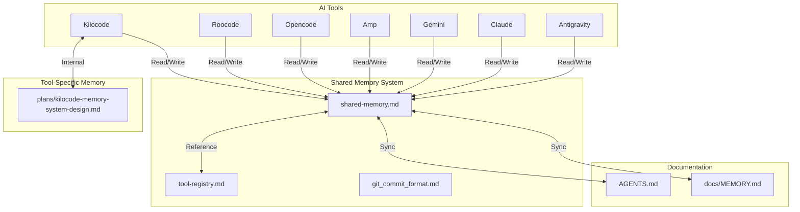

# Shared Memory Pool

This file serves as a consolidated memory pool that all AI tools (Kilocode, Roocode, Opencode, Amp, Gemini, Claude, Antigravity, etc.) can read from and write to.

## Purpose

The shared memory pool provides:
- **Unified Context**: All tools share the same project understanding
- **Cross-Tool Continuity**: Work started in one tool can be continued in another
- **Consolidated History**: Single source of truth for project state
- **Tool Agnostic**: Works independently of any specific tool's internal memory system

## Structure



## Working Pattern

### When Starting a Session (Any Tool)

1. **Read Tool Registry** (`docs/memory/tool-registry.md`):
   - Identify which tool you are (Kilocode, Roocode, Opencode, etc.)
   - Find your tool's entry in the registry
   - Understand your tool's role and any special instructions

2. **Read Shared Memory** (`docs/memory/shared-memory.md`):
   - Read recent entries (last 5-10) to understand current state
   - Check "Current Focus" for what was being worked on
   - Review "Pending Tasks" for incomplete work
   - Note any tool-specific context relevant to your work

3. **Read Tool-Specific Documentation** (if exists):
   - Read your tool's design document (e.g., `plans/kilocode-memory-system-design.md`)
   - Understand tool-specific patterns and conventions
   - Adapt your working pattern to the tool's strengths

4. **Read Project Documentation**:
   - Read relevant sections of `AGENTS.md`
   - Read `docs/MEMORY.md` for query history and context
   - Understand project structure and conventions

5. **Report to User**:
   - Confirm context is loaded
   - Summarize what you know about the project
   - List pending tasks with `t{number}` prefix
   - Offer to continue with next task or accept new work

### During Work (Any Tool)

1. **Make Incremental Changes**: Update shared memory as you work, not just at the end
2. **Document Decisions**: Explain why you're making changes, not just what
3. **Sync with Project Docs**: Keep `docs/MEMORY.md` and other docs in sync with shared memory
4. **Track Tool-Specific Notes**: Document tool-specific patterns or issues in tool registry

### When Ending a Session (Any Tool)

1. **Update Shared Memory**:
   - Document work completed
   - Update task statuses
   - Add any new patterns or rules learned
   - Note any incomplete work that should be continued

2. **Sync with Tool-Specific Memory**:
   - If your tool has its own memory system, sync relevant information
   - Cross-reference shared memory entries with tool-specific entries
   - Ensure consistency between systems

3. **Report Completion**:
   - Summarize what was accomplished
   - List any incomplete items
   - Suggest next steps if appropriate

## Memory Entry Format

### [YYYY-MM-DD HH:MM UTC] - Tool: {Tool Name} - {Title}

**Tool**: Kilocode | Roocode | Opencode | Amp | Gemini | Claude | Antigravity
**Session ID**: {Unique identifier for this session}
**Task Type**: Assigned Task | User-Directed Narrative | Discovery | Planning
**Status**: In Progress | Completed | Blocked | Abandoned

**Summary**: Brief summary of what was done or is being worked on

**Context**: Any relevant context, environment, previous state, etc.

**Decisions Made**: (optional)
- Decision 1: Reason for decision
- Decision 2: Reason for decision

**Files Changed**: (optional)
- Added: [`file1`](file1), [`file2`](file2)
- Modified: [`file3`](file3)
- Deleted: [`file4`](file4)

**Tools Used**: (optional)
- MCP servers: {list if any}
- External APIs: {list if any}
- Special commands: {list if any}

**Outcome**: Result or status (e.g., "Completed", "In Progress", "Blocked")

**Notes**: (optional)
Any additional context, issues encountered, workarounds, etc.

**Cross-Tool Context**: (optional)
Information relevant to other tools continuing this work

**Related Entries**: (optional)
Links to related entries in shared memory or tool-specific memory

### [2026-01-31 09:00 UTC] - Tool: Opencode - Build release v0.0.2

**Tool**: Opencode
**Task Type**: User-Directed Task
**Status**: Complete

**Summary**: Built release v0.0.2 - version bump from 0.0.1 to 0.0.2

**Context**: User requested to build release. Project has no TypeScript source files yet (scaffolding phase), so compilation step expectedly fails.

**Outcome**: Version bumped to 0.0.2. Compilation error expected (no source files to compile).

**Notes**:
- src/ directory only contains .gitkeep - no TypeScript source files yet
- buildrelease script runs: npm version patch && npm run compile
- Version incremented successfully: 0.0.1 → 0.0.2
- This is expected behavior for scaffolding/documentation project

---

### [2026-01-31 09:15 UTC] - Tool: Opencode - Update message truncation logic

**Tool**: Opencode
**Task Type**: User-Directed Task
**Status**: Complete

**Summary**: Changed message truncation from line-based to character-based with improved formatting

**Context**: User requested truncation look at characters instead of lines, break in the middle with "...", and AI summary in [] brackets at top.

**Decisions Made**:
- Changed from 9-line limit to 300-character limit for better consistency
- Truncates by taking first 150 chars + last 150 chars with "..." in between
- AI summary now wrapped in [] brackets and placed at top

**Files Changed**:
- Modified: [`oc-message-explorer/static/app.js`](oc-message-explorer/static/app.js:547)

**Outcome**: Message truncation now uses character-based approach with clearer visual indicators.

---

### [2026-01-31 09:30 UTC] - Tool: Opencode - Add weighted search ranking

**Tool**: Opencode
**Task Type**: User-Directed Task
**Status**: Complete

**Summary**: Implemented weighted scoring for search results, exact matches rank higher

**Context**: User requested weighted matches on search where exact matches should be ranked higher.

**Decisions Made**:
- Content matches weighted 150 (exact) / 100 (fuzzy)
- Summary matches weighted 90 (exact) / 60 (fuzzy)
- Type matches weighted 50 (exact) / 30 (fuzzy)
- Tag matches weighted 35 (exact) / 20 (fuzzy)
- fuzzy match quality factor based on gap streak between characters

**Files Changed**:
- Modified: [`oc-message-explorer/main.go`](oc-message-explorer/main.go:597)
- Modified: [`oc-message-explorer/static/app.js`](oc-message-explorer/static/app.js:547)
- Modified: [`docs/memory/shared-memory.md`](docs/memory/shared-memory.md)

**Outcome**: Search results now weighted - exact matches and better fuzzy matches rank higher.

---

### [2026-01-31 09:45 UTC] - Tool: Opencode - Commit and push changes

**Tool**: Opencode
**Task Type**: Maintenance
**Status**: Complete

**Summary**: Committed and pushed search weighting and message truncation improvements

**Context**: User requested commit and push of recent changes.

**Commit**: `7cc3bd6` - "~ [ search weighting and message truncation ]:"

**Changes Pushed**:
- Weighted search scoring with exact match priority
- Character-based message truncation (300 chars)
- AI summary in [] brackets at top
- Shared memory documentation updates

**Outcome**: All changes committed and pushed to origin/master successfully.

---

### [2026-01-31 10:00 UTC] - Tool: Opencode - Fix checkbox selection for combining

**Tool**: Opencode
**Task Type**: Bug Fix
**Status**: Complete

**Summary**: Fixed checkbox selection allowing multiple message selection for combining

**Context**: User reported inability to select checkboxes to combine multiple messages. Investigation revealed the checkbox click handler was relying on toggleSelection which called updateMessage and renderTree, causing complete UI rebuild and potential state loss.

**Decisions Made**:
- Read checkbox.checked state directly from DOM instead of calculating
- Use e.preventDefault() to ensure native checkbox behavior works
- Manually toggle 'selected' class on contentDiv for immediate visual feedback
- Avoid full re-render on checkbox click to preserve state

**Files Changed**:
- Modified: [`oc-message-explorer/static/app.js`](oc-message-explorer/static/app.js:489)

**Outcome**: Checkboxes now work correctly for selecting multiple messages for combining. Binary rebuilt and ready.

**Testing Required**: User should test multiple checkbox selection and Combine functionality.

---

### [2026-02-01 10:00 UTC] - Tool: Opencode - Implement SQLite cache system

**Tool**: Opencode
**Task Type**: User-Directed Task
**Status**: Complete (Backend), Complete (Frontend), Complete (Fixes), In Progress (Testing)

**Summary**: Implemented full SQLite cache system with automatic sync and lock functionality

**Context**: User requested implementation of local SQLite cache system for OpenCode messages with automatic sync, lock state persistence, and cancelable sync operations.

**Decisions Made**:
- Created `db.go` with full SQLite schema (folders, nodes, tags tables)
- Created `sync.go` with multi-phase sync (init → reading → building → writing → complete)
- Modified `main.go` Store struct to include db and syncManager
- Added API endpoints: `/api/sync`, `/api/sync/cancel`, `/api/messages/{id}` (PATCH for lock)
- Added `Locked` field to MessageNode struct
- Automatic sync on startup if DB is empty
- Background sync if DB has data
- Progress updates every 100 messages or 1 second
- Sync status UI in header with cancel button
- Lock icon (🔒/🔓) on each message node

**Files Changed**:
- Added: [`oc-message-explorer/db.go`](oc-message-explorer/db.go) - Database layer with CRUD operations
- Modified: [`oc-message-explorer/main.go`](oc-message-explorer/main.go) - Store integration, API endpoints
- Modified: [`oc-message-explorer/static/index.html`](oc-message-explorer/static/index.html) - Sync status UI, lock icon CSS
- Modified: [`oc-message-explorer/static/app.js`](oc-message-explorer/static/app.js) - Sync handlers, lock toggle, progress updates
- Modified: [`oc-message-explorer/go.mod`](oc-message-explorer/go.mod) - Added modernc.org/sqlite v1.33.1

**Outcome**: SQLite cache system fully implemented. Database: `{exeName}.db`. Automatic sync on startup. Lock state persisted. Build successful.

**Testing Tasks Pending**:
- Test first run (empty cache)
- Test second run (cached data)
- Test search performance
- Test lock/unlock persistence
- Test sync cancellation
- Test database corruption recovery
- Test partial sync recovery

---

### [2026-02-01 11:00 UTC] - Tool: Opencode - Fix database deadlock

**Tool**: Opencode
**Task Type**: Bug Fix
**Status**: Complete

**Summary**: Fixed deadlock in GetNodesForFolder during initial database load

**Context**: User reported "fatal error: all goroutines are asleep - deadlock!" when first loading. Stack trace showed deadlock in getTagsForNode called from GetNodesForFolder while holding read lock.

**Decisions Made**:
- Batched tag queries using single query with IN clause and placeholders()
- Removed per-node database calls (getTagsForNode, getChildrenIDs) from GetNodesForFolder
- Build parent-child relationships in-memory after loading all nodes
- Added helper function `placeholders(count int)` for dynamic SQL generation
- Removed mutex from GetNode (no longer needed for single node queries)
- Ordered nodes by timestamp DESC in initial query

**Files Changed**:
- Modified: [`oc-message-explorer/db.go`](oc-message-explorer/db.go) - Fixed GetNodesForFolder deadlock, added placeholders() helper

**Outcome**: Database deadlock fixed. App should now load successfully without locking up.

**Testing**: User should run `oc-message-explorer.exe` again to verify successful startup.


---

### [2026-02-01 15:36 UTC] - Tool: Opencode - Fix JSON unmarshaling for summary field

**Tool**: Opencode
**Task Type**: Bug Fix
**Status**: Complete

**Summary**: Fixed JSON unmarshaling error for messages with boolean summary field

**Context**: User reported unmarshaling errors: "json: cannot unmarshal bool into Go struct field OpenCodeMessage.summary of type struct { Title string \"json:\\\"title\\\"\" }". Some OpenCode message files have `summary` as a boolean (false) instead of an object with `title` field.

**Decisions Made**:
- Changed `OpenCodeMessage.Summary` field from `struct { Title string }` to `any` type
- Added `getSummaryTitle(summary any)` helper function to handle both bool and object types
- Returns empty string when summary is bool (false) or nil
- Extracts `title` from map[string]any when summary is an object
- Updated both main.go and db.go to use new helper function

**Files Changed**:
- Modified: [`oc-message-explorer/main.go`](oc-message-explorer/main.go:84) - Changed Summary type to `any`, added getSummaryTitle helper
- Modified: [`oc-message-explorer/db.go`](oc-message-explorer/db.go) - Updated to use getSummaryTitle helper

**Outcome**: JSON unmarshaling now handles both boolean and object summary types. All messages should load without errors.

**Testing**: User should run `oc-message-explorer.exe` to verify all messages load successfully.

---

### [2026-02-01 15:53 UTC] - Tool: Opencode - Build documentation and switch to master

**Tool**: Opencode
**Task Type**: Maintenance
**Status**: Complete

**Summary**: Switched to master branch, pulled latest changes, built exe, documented build process

**Context**: User requested to switch to main (master) branch, pull, build exe, and document how to build in README.

**Decisions Made**:
- Switched from Branch_0b5cc540 to master branch
- Pulled 2 commits from origin/master (PR #5 was merged)
- Built executable successfully: oc-message-explorer/oc-message-explorer.exe (15MB)
- Enhanced build documentation in README.md with:
  - Prerequisites section (Go 1.21+)
  - Standard vs optimized build options
  - Build output size information
  - Portability notes

**Files Changed**:
- Modified: [`README.md`](README.md:16) - Enhanced "Quick Start > Build the Application" section
- Modified: [`README.md`](README.md:177) - Enhanced "Scripts > Build" section
- Created: `oc-message-explorer/oc-message-explorer.exe` (15MB executable)

**Outcome**: Build process now clearly documented in README.md with multiple build options and notes on executable size and portability.

---

## Current Focus

**Summary**: Enhanced build documentation in README.md

**Tool**: Opencode
**Time**: 2026-02-01 00:00 UTC
**Summary**: SQLite cache system implementation
**Status**: Backend Complete, Frontend Complete, Testing In Progress

### Context

User requested implementation of local SQLite cache system for OpenCode messages. Branch `ts-sqlite-cache` created for this work.

### Planning

**SQLite Cache System Implementation**:
- Database file: `{exeName}.db` (dynamically determined)
- Lock state: Persisted to database
- Sync behavior: Automatic on startup, cancelable, cached data visible immediately
- Progress updates: Every 100 messages or 1 second (whichever is more frequent)
- Message size: No limit
- Database corruption: Delete and recreate
- Partial syncs: Keep successful data, mark as partial, retry next time
- Progress UI: Always visible during sync (non-blocking)

**Implementation Phases**:
1. Database Layer (`db.go`) - Schema, CRUD operations, search - **Complete**
2. Sync Manager (`sync.go`) - Multi-phase sync with progress - **Complete**
3. Store Integration (`main.go`) - Replace in-memory with DB - **Complete**
4. API Enhancements - `/api/sync`, `/api/sync/cancel`, `/api/messages/{id}/lock` - **Complete**
5. Frontend Updates (`index.html`, `app.js`) - Sync UI, lock icons - **Complete**
6. Dependencies - Add `modernc.org/sqlite` - **Complete**
7. Build & Test - Performance targets and testing strategy - **In Progress**

### Pending Tasks

- [x] Create `oc-message-explorer/db.go` with full schema and CRUD operations
- [x] Create `oc-message-explorer/sync.go` with multi-phase sync logic
- [x] Modify `oc-message-explorer/main.go` Store struct and initialization
- [x] Add new API endpoints (`/api/sync`, `/api/sync/cancel`, `/api/messages/{id}/lock`)
- [x] Update `oc-message-explorer/static/index.html` with sync status UI and CSS
- [x] Update `oc-message-explorer/static/app.js` with sync handling and lock toggle
- [x] Update `oc-message-explorer/go.mod` with `modernc.org/sqlite` dependency
- [ ] Test first run (empty cache)
- [ ] Test second run (cached data)
- [ ] Test search performance
- [ ] Test lock/unlock persistence
- [ ] Test sync cancellation
- [ ] Test database corruption recovery
- [ ] Test partial sync recovery
- [ ] Enhanced search with advanced options (regex, filters)
- [ ] Export in additional formats (PDF, plain text)
- [ ] Message versioning and comparison

### Configuration Files

**.env** - Environment variables stored here:
- OPENAI_API_KEY - OpenAI API key
- OPENAI_MODEL - Default model for optimization
- OPTIMIZATION_PROMPT - Custom optimization prompt
- PROJECT_PATH - Path to project directory
- AGENTS_PATH - Path to AGENTS.md file

**config.json** - Internal config storage for todos and settings backup

---

## Quick Reference

### Tool Registry Reference

| Tool | Registry Entry | Internal Memory | Special Patterns |
|------|----------------|-----------------|-----------------|
| Kilocode | [`tool-registry.md`](./tool-registry.md) | `plans/kilocode-memory-system-design.md` | Automated memory tracking, version logging |
| Roocode | [`tool-registry.md`](./tool-registry.md) | (to be discovered) | (to be documented) |
| Opencode | [`tool-registry.md`](./tool-registry.md) | Uses this shared memory | File operations, web tools |
| Amp | [`tool-registry.md`](./tool-registry.md) | (to be discovered) | (to be documented) |
| Gemini | [`tool-registry.md`](./tool-registry.md) | (to be discovered) | (to be documented) |
| Claude | [`tool-registry.md`](./tool-registry.md) | (to be discovered) | (to be documented) |
| Antigravity | [`tool-registry.md`](./tool-registry.md) | (to be discovered) | (to be documented) |

### Project Context

**Project**: OC Message Explorer - A tool for exploring and analyzing OpenChat messages

**Last Updated**: 2026-01-31

**Current Phase**: UI enhancements and feature additions

### Shared Memory Guidelines

**For All Tools**:

1. **Read First, Write Second**: Always read shared memory before making changes
2. **Document Decisions**: Explain why, not just what
3. **Keep It Synced**: Update shared memory as you work, not just at end
4. **Be Concise**: Use clear, brief summaries that other tools can understand
5. **Reference Other Systems**: Cross-reference with tool-specific memory when appropriate

**Sanitization Rules**:
- API keys → `[API_KEY]`
- Personal emails → `[USER_EMAIL]`
- Credentials → `[CREDENTIAL]`
- URLs with sensitive data → `[SENSITIVE_URL]`
- File paths with personal info → `[PERSONAL_PATH]`

**Entry Size Guidelines**:
- Each entry should be concise (100-300 words typically)
- Use bullet points for lists
- Use markdown links for file references
- Separate entries clearly with `---`

### Navigation Primitives

**Coherence Wormhole** (Speed Optimization):
- Trigger: When converging on clear target, intermediate steps implied/resolved
- Protocol: Ask "Would you like me to take a coherence wormhole and jump straight there?"
- Safeguard: Only offer when destination stable, skip only if user agrees
- Never skip for verification, auditability, or trust-critical work

**Vector Calibration** (Direction Optimization):
- Trigger: When nearby target Y better aligns with intent (generality, simplicity, leverage, durability)
- Protocol: Ask "Would you like to redirect to Y, briefly compare X vs Y, or stay on X?"
- Safeguard: Only trigger with high confidence, no second-guessing if user stays on X
- One well-timed course correction option

See [`agents.min.md`](../agents.min.md) for complete navigation primitives documentation.

**Quick Reference**: [`agents.min.md`](../agents.min.md) - Optimized quick-start guide (read first for fast onboarding)

### Git Commit Format

This project uses enhanced conventional commit messages with emojis. All tools should follow this format when generating commits.

**Commit Message Format**:
```markdown
~ [ short up to 8 word summary ]:

<emoji> <type>(<scope>): <subject>

<body>
```

**Documentation**: [`git_commit_format.md`](./git_commit_format.md) - Complete commit message specification

**Types and Emojis**:
- `feat` ✨ - New feature or functionality
- `fix` 🐛 - Bug fix or error correction
- `docs` 📝 - Documentation changes
- `style` 🎨 - Code style changes
- `refactor` ♻️ - Code refactoring
- `perf` ⚡️ - Performance improvements
- `test` ✅ - Testing changes
- `build` 📦 - Build system changes
- `ci` 🚀 - CI/CD configuration
- `chore` 🔧 - Maintenance tasks
- `revert` ⏪ - Reverting previous commits
- `i18n` 🌐 - Internationalization

**Commit Message Rules**:
- Summary: Maximum 8 words, present tense, capture essence
- Subject: Imperative mood ("add" not "added"), lowercase, max 50 chars
- Body: Bullet points with "-", explain "what" and "why", not "how"
- Breaking Changes: `BREAKING CHANGE: <description>` in footer
- Prefix: Always start with `~ [ short up to 8 word summary ]:`

## Integration Notes

### Tool-Specific Considerations

**Kilocode**:
- Has its own automated memory system in `plans/kilocode-memory-system-design.md`
- Should sync completed work to shared memory at end of session
- Can reference shared memory for cross-session continuity

**Roocode**:
- Internal memory system yet to be discovered
- Should create tool registry entry when discovered
- Adapt Kilocode patterns where appropriate

**Opencode**:
- Primary maintainer of this shared memory system
- Uses file operations (read, write, edit, glob, grep)
- Has web tools (webfetch, websearch, codesearch)
- No internal memory system - relies entirely on shared memory
- Should follow [`git_commit_format.md`](./git_commit_format.md) when creating commits

**Amp, Gemini, Claude, Antigravity**:
- Internal memory systems yet to be discovered
- Should create tool registry entries when discovered
- Follow shared memory working pattern

### Conflict Resolution

When multiple tools have conflicting information:

1. **Project Docs Take Precedence**: `docs/MEMORY.md`, `AGENTS.md` are authoritative
2. **Shared Memory Is Reference**: Use shared memory for cross-tool continuity
3. **Tool-Specific Memory Is Supplemental**: Use for tool-specific patterns only
4. **Document Conflicts**: When you find conflicts, document them in shared memory

### Version Control

- `docs/memory/` directory is git-tracked
- All memory files are versioned
- Use commit messages that reference memory updates
- Example: `docs(memory): shared memory - add tool registry entry for Roocode`


---
